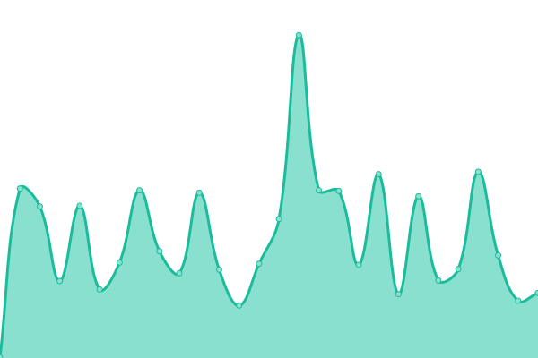
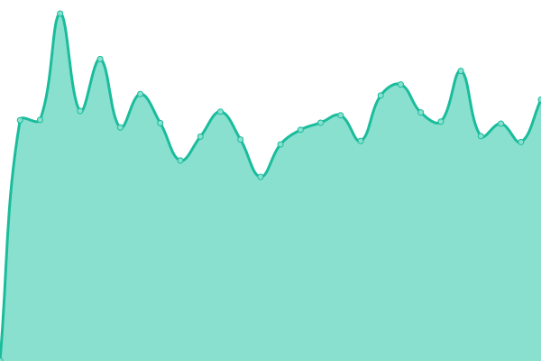
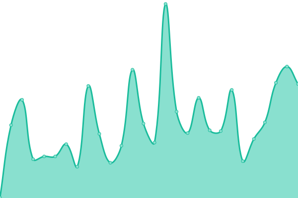

# [📈 Live Status](https://uptime.stefka.eu): <!--live status--> **🟩 All systems operational**

This repository contains the open-source uptime monitor and status page for [Jiří Štefka](https://stefka.eu), powered by [Upptime](https://github.com/upptime/upptime).

With [Upptime](https://upptime.js.org), you can get your own unlimited and free uptime monitor and status page, powered entirely by a GitHub repository.

I use it to monitor my website (and other services) without the need for a 3rd party server or some proprietary service.

<!--start: status pages-->
<!-- This summary is generated by Upptime (https://github.com/upptime/upptime) -->
<!-- Do not edit this manually, your changes will be overwritten -->
<!-- prettier-ignore -->
| URL | Status | History | Response Time | Uptime |
| --- | ------ | ------- | ------------- | ------ |
|  [stefka.eu](https://stefka.eu) | 🟩 Up | [stefka-eu.yml](https://github.com/jiriks74/upptime/commits/HEAD/history/stefka-eu.yml) | 

 642ms
     
 | 

<a href="https://uptime.stefka.eu/history/stefka-eu">100.00%</a>
    

|  [Gitea](https://gitea.stefka.eu) | 🟩 Up | [gitea.yml](https://github.com/jiriks74/upptime/commits/HEAD/history/gitea.yml) | 

 744ms
     
 | 

<a href="https://uptime.stefka.eu/history/gitea">99.74%</a>
    

|  [OpenProject](https://openproject.stefka.eu) | 🟩 Up | [open-project.yml](https://github.com/jiriks74/upptime/commits/HEAD/history/open-project.yml) | 

 3808ms
     
 | 

<a href="https://uptime.stefka.eu/history/open-project">99.67%</a>
    

<!--end: status pages-->

[**Visit my status website →**](https://uptime.stefka.eu)

## 📄 License

- Powered by: [Upptime](https://github.com/upptime/upptime)
- Code: [MIT](./LICENSE) © [Anand Chowdhary](https://anandchowdhary.com), supported by [Pabio](https://pabio.com)
- Data in the `./history` directory: [Open Database License](https://opendatacommons.org/licenses/odbl/1-0/)
